# 1. Qu’est-ce qu’une vulnérabilité informatique ?

Une vulnérabilité est une faille ou une faiblesse dans un système informatique (logiciel, matériel, réseau…) qui peut être exploitée par un attaquant pour compromettre la sécurité (vol de données, prise de contrôle, etc.).

**Les notations:**

- **CVE (Common Vulnerabilities and Exposures)** : Identifiant unique pour chaque vulnérabilité.
- **CVSS (Common Vulnerability Scoring System)** : Score qui mesure la gravité d’une vulnérabilité.
- **EPSS (Exploit Prediction Scoring System)** : Score qui estime la probabilité qu’une vulnérabilité soit exploitée prochainement.
- **Exploit** : Code ou une méthode permettant d’exploiter la vulnérabilité.

# Classification des vulnérabilités

**Auteur :** Elif Jaffres

**Date :** 24/10/2025

## 1. Eternal Blue

- **Référence CVE** : CVE-2017-0144
- **Description** : Faille dans le protocole SMBv1 de Windows permettant l’exécution de code à distance par un attaquant.
-  **Éléments d’infrastructure concernés** : Systèmes Windows utilisant SMBv1
-  **Score CVSS** : 8.1
- **Exploit public** : Oui
-  **Score EPSS** : 0.97

  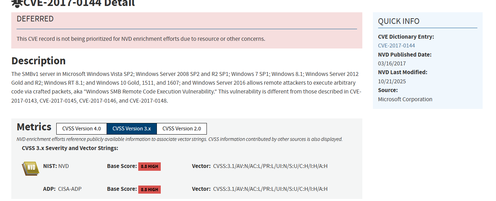
  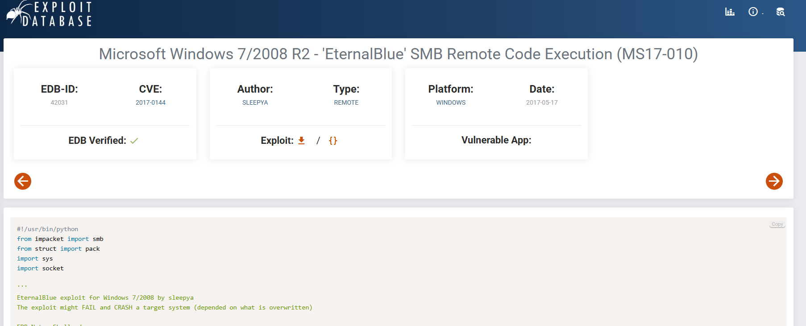
  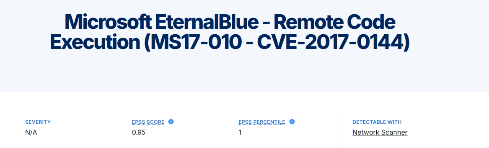

---

## 2. KRACK

- **Référence CVE** : CVE-2017-13077 (....13082)
- **Description** : KRACK est une faille dans le protocole WPA2 permettant à un attaquant d’intercepter et de décrypter le trafic Wi-Fi.
-  **Éléments d’infrastructure concernés** : Tous les appareils utilisant le Wi-Fi WPA2
-  **Score CVSS** : 5.4
-  **Exploit public** : Non, mais existe des scripts sur github; [https://github.com/vanhoefm/krackattacks-scripts]([https://github.com/vanhoefm/krackattacks-scripts]())
-  **Score EPSS** : 0.77

  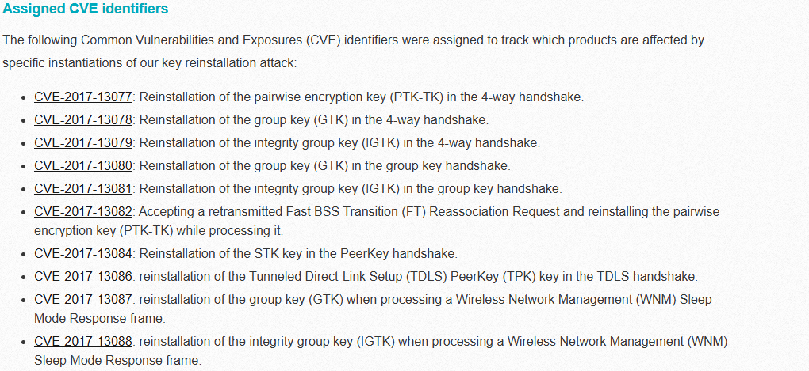
  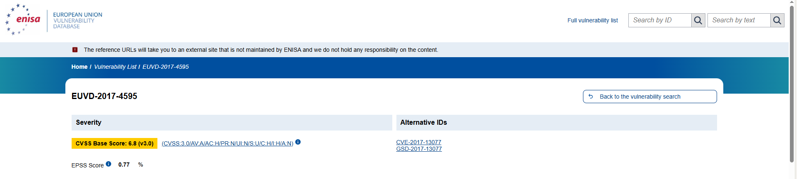

---

## 3. Log4Shell

- **Référence CVE** : CVE-2021-44228
- **Description** : Faille critique dans la bibliothèque Log4j permettant l’exécution de code à distance via des journaux malveillants.
-  **Éléments d’infrastructure concernés** : Applications utilisant Log4j (serveurs web, applications métiers)
-  **Score CVSS** : 10.0
-  **Exploit public** : Oui
-  **Score EPSS** : 0.97
 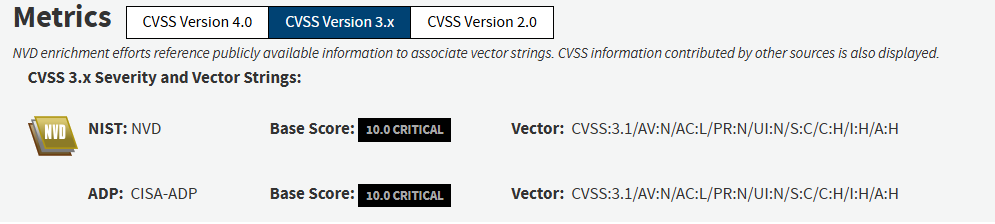 
 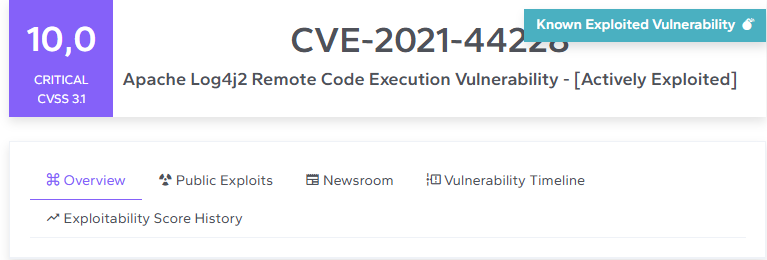
 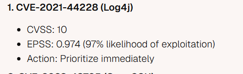

## 4. Looney Tunables

- **Référence CVE** : CVE-2023-4911
- **Description** : Faille dans la bibliothèque GNU C (glibc) permettant une élévation de privilèges locale sur Linux.
-  **Éléments d’infrastructure concernés** : Systèmes Linux utilisant glibc
-  **Score CVSS** : 7.8
-  **Exploit public** : Oui
-  **Score EPSS** : 0.78

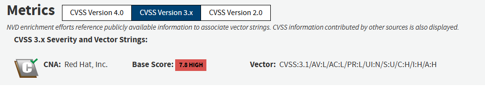
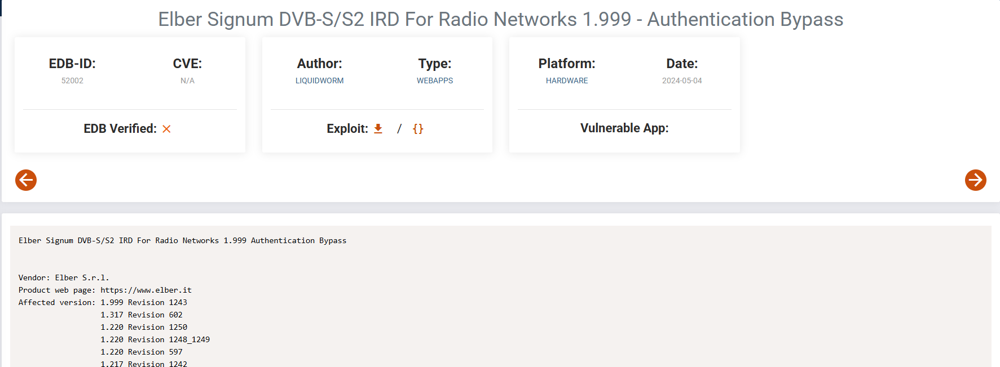
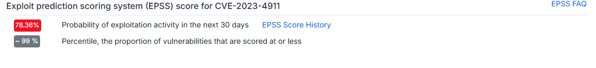
---

## 5. Vulnérabilité récente : Citrix Bleed

- **Référence CVE** : CVE-2023-4966
- **Description** : Faille dans Citrix NetScaler Gateway permettant la fuite de données sensibles.
-  **Éléments d’infrastructure concernés** : Citrix NetScaler ADC et Gateway
-  **Score CVSS** : 9.4
-  **Exploit public** : Oui
-  **Score EPSS** : 0.94

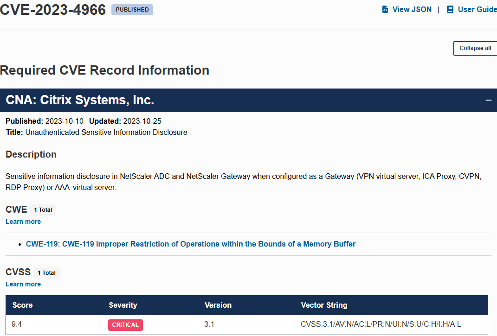
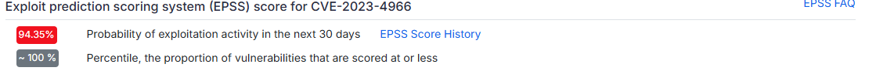
---

*Ressources :*

- CVE.org
- CERT-FR
- Exploit-DB
- CVSS Calculator
- EPSS
- Avast
- VDI

